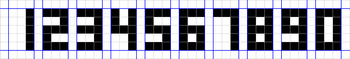

# Perceptron Algorithm
  The learning algorithm distinguishes one digit from the rest.  
  
  
  001  111  111  101  111  111  111  111  111  111
  001  001  001  101  100  100  001  101  101  101
  001  111  111  111  111  111  001  111  111  101
  001  100  001  001  001  101  001  101  001  101
  001  111  111  001  111  111  001  111  111  111
    
  Input data:  
  1 – 001001001001001  
  ...................  
  9 – 111101111001111  
  0 – 111101101101111  
  
  The perceptron will be a single neuron with 15 inputs and an activation threshold function.   
  The parameters of the perceptron will be one array W - 15 weights - and the threshold value b.
  
  The perceptron learning algorithm is as follows:
  - If the neural network correctly recognized / rejected the selected digit, then nothing happens.
  - If the neural network makes a mistake and recognizes the wrong number as selected, then you need to reduce the weights of those connections through which the signal passed.
  - If the neural network was mistaken and did not recognize the desired number, then all the weights through which the signal passed should be increased.
  
  In a loop that will repeat a certain number of times, an array corresponding to a random digit must be fed to the input of the neural network. 
  If the network's answer is incorrect, you need to change the weights in accordance with the algorithm.
